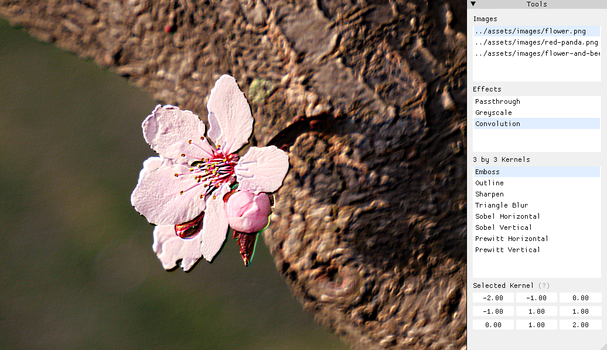
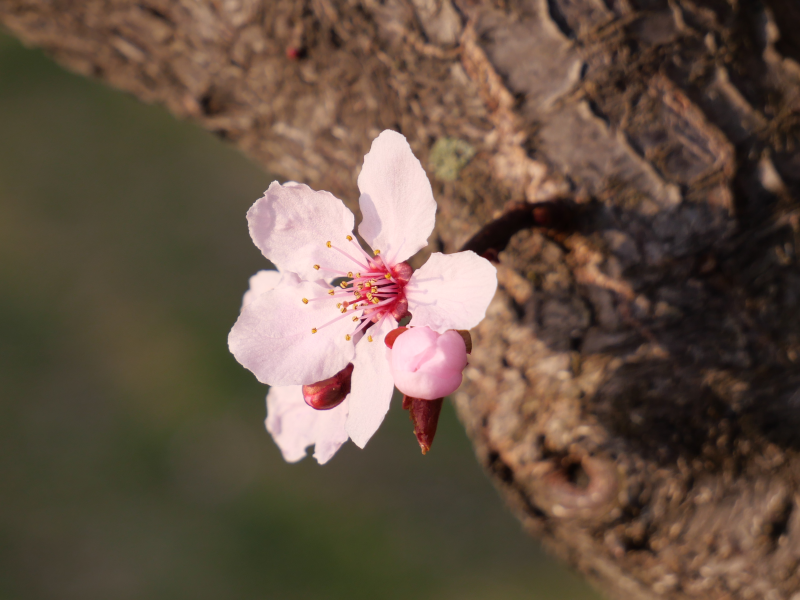
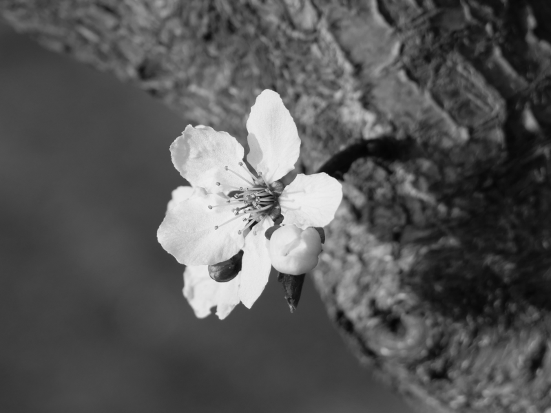
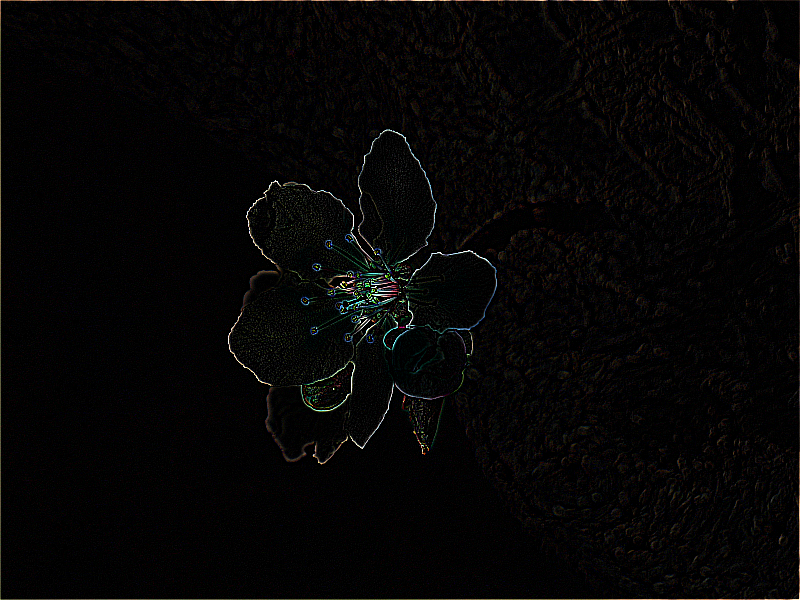
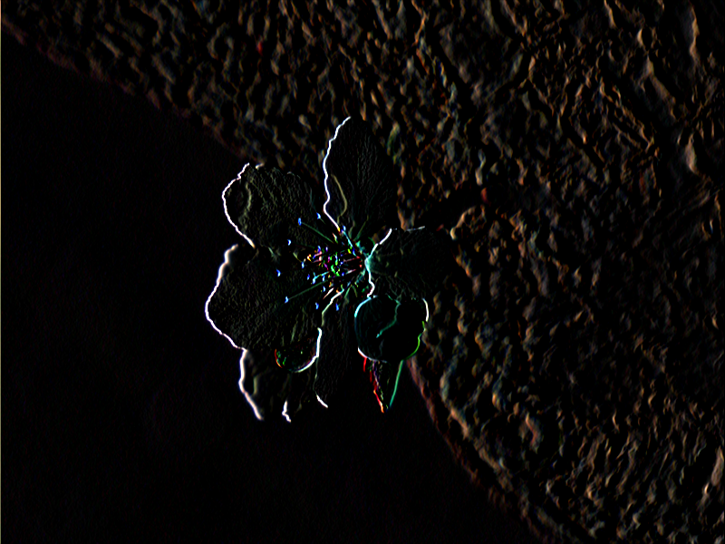
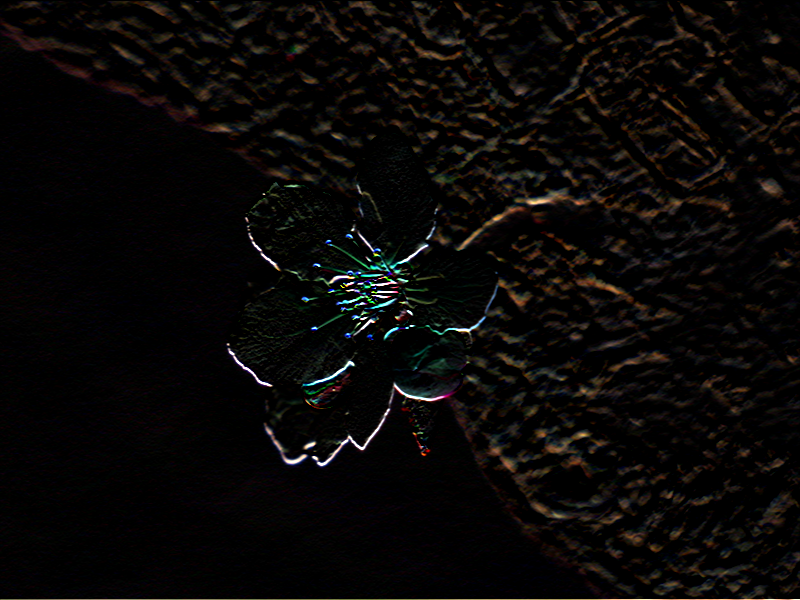
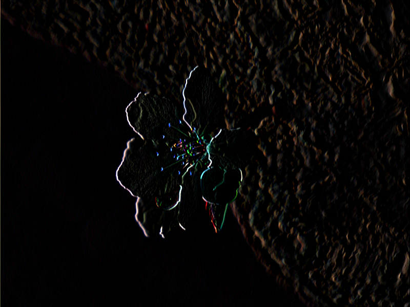
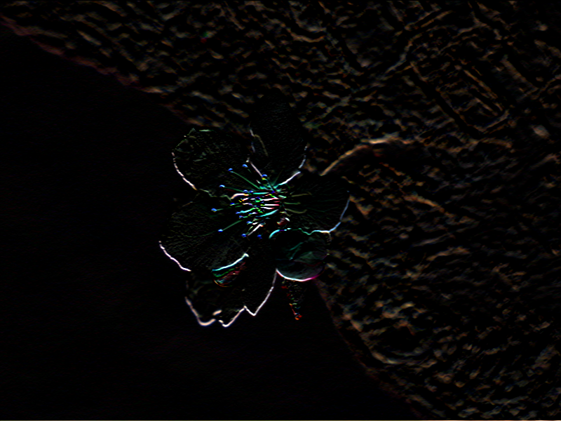

# OpenGL Image Processing Testbench

Hongyu ZHAI ([Github](https://github.com/iamzhaihy), [LinkedIn](https://www.linkedin.com/in/hongyu-zhai-34b961139/))




## About this Project

To me, GPU-accelerated image processing is very interesting. The boilerplate code, on the other hand, is no fun to write. To enable faster development, I wrote myself a small toolkit and used it to make this image processing testbench. It is easy to switch between images, effects, and convolution kernels. 

This is the sibling project of https://github.com/iamzhaihy/hzgl-mesh-viewer.


## Compile and Run

Before you start, make sure you have the following things:

- CMake 3.15+
- A C++ compiler for your platform
- Hardware that supports modern OpenGL

To run the program yourself, type the following commands

```bash
git clone --recursive https://github.com/iamzhaihy/hzgl-image-processing.git
cd hzgl-image-processing
mkdir build && cd build
cmake ..
cmake --build .
```

The external libraries are all linked statically, which means it should work out of the box if you have the things above.


## Basic Controls

Using the GUI, the user can:

- Switch between available images by clicking on an item in the "Images" list
- Switch between shader programs by clicking on an item in the "Effects" list
  - Choose the kernel if "Convolution" has been selected
  - Tweak the 3 by 3 kernels via the widgets in the bottom

Several keyboard shortcuts are provided:

- Press `Q` or `Escape` to quit the program
- Press `F` or `PrintScreen` to take a screenshot (will be stored in the same directory as the executable)


## Implemented Filters

**Passthrough (identity)**



**Greyscale**



**Convolution (Emboss)**


**Convolution (Outline)**



**Convolution (Sharpen)**


**Convolution (Triangle Blur)**


**Convolution (Sobel Horizontal)**



**Convolution (Sobel Vertical)**



**Convolution (Prewitt  Horizontal)**



**Convolution (Prewitt Vertical)**




## Future Plans for the Project

Here is my plan for the future improvement

- More flexible window settings
  - Correctly handle window resizing
- Texture filtering related
  - Adjust filtering method to make kernels work better on high resolution pictures
- Bigger and more complex kernels
  - Gaussian Blur
  - Laplacian of Gaussian
- Improve interactive UI
  - Load image file from a dropdown file menu
  - Allow the user to apply multiple effect at the same time
  - Add a simple editor that recompiles shaders after the user saves changes


## References
Below are the sources I referred to when developing:

- Machine Vision (R. Jian, R. Kasturi and B. G. Schunck)
- https://docs.gimp.org/2.10/en/gimp-filter-convolution-matrix.html
- https://webglfundamentals.org/webgl/lessons/webgl-image-processing.html
- https://www.objc.io/issues/21-camera-and-photos/gpu-accelerated-image-processing/
- https://www.objc.io/issues/21-camera-and-photos/gpu-accelerated-machine-vision/